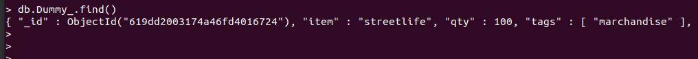

MongoDB docker set up
=========================================

#### sources

* [github repo](https://github.com/docker-library/mongo)
* [docker page](https://hub.docker.com/_/mongo)


#### get image

``` sh
docker pull Mongo
```

### Env file

env file contains super user connection params and db name

### run

pull image first, or let the 'docker run' command pull the latest (5.0.4) image

run mongo image as a container, with options:

* name the container
* attach it to the docker network
* .env file (rename and adjust .envcompact.sample to .env) for secret and db-name
* restart behaviour
* (for testing purposes) expose on port 930 (never use default port as a setting) 
* data volume
* detached mode

```sh
cd db && \
docker run \
    --name spotigraph-db  \
    --network spotigraph-net \
    --env-file .env \
    --restart unless-stopped \
    -p  930:27017 \
    -v /data:/etc/mongo \
    -d \
    mongo
```


### tests

spotify-db container is up

```sh
docker ps
docker inspect spotigraph-db
```

access to the new spotify_db database through [shell](../doc/scr-admin-connect-docker-mongo.png)

```sh
docker run -it --rm --network spotigraph-net mongo \
    mongo --host spotigraph-db \
        -u mongoadmin \
        --authenticationDatabase admin \
        spotigraph_db
```

db is up

```sh
db.getName()
```

insert dummy data (creating "Dummy_" Collection on the fly)

```sh
db.Dummy_.insertOne(
   { item: "streetlife", qty: 100, tags: ["marchandise"], shipment: { patate: 28, piment: 35.5, mesure: "kg" } }
)
```

Success on insert


reading from "Dummy_" collection
